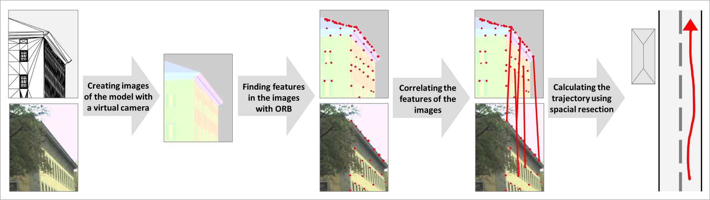

<a href="https://www.tum.de/en/">
  
</a>

# 🚀 LoD3ForLocalization
This is the code of the Bachelor's Thesis by Antonia Bieringer at [Technical University of Munich](https://www.tum.de/en/). The submission date is 22 August 2023.



The program aims to compare the differences between LoD2 and LoD3 models for the localization of vehicles. For the full text of the Bachelor's Thesis and a more detailed description of the code, please see [Evaluation of the Effect of Enriched Facade Models on Image-Based Localization of Vehicles](https://mediatum.ub.tum.de/1720655). 

## ⚙️ Packages to install
- numpy
- open3D
- matplotlib
- cv2

To install all packages in a new environment, please run the following code:
```
conda create --name LoD3ForLocalization python=3.10.9
conda activate LoD3ForLocalization
pip install numpy
pip install open3d
pip install matplotlib
pip install opencv-python
```

## 🔢 Needed inputs and given outputs
The inputs for this program are **.obj-files** of the corresponding buildings. It is recommended to store the data for windows, roofs, and walls separately to get the best results. The program generates results for different input IDs; more separate inputs lead to better distinguishable results.

The outputs are the **camera position and orientation** of the vehicle and the **accuracy**.

## ▶️ How to run the program
You can run the program as is with the available testing data. To use your own data, you need to make some adjustments:
- change the settings in the file **main.py** (the config, which can be adjusted, is stored in lines 20-48)
- change the paths to the LoD2 and LoD3 models in the file **RayCasting.py** (see lines 27,38,41,44,45,46)

To run the program, the main.py file has to be run. In line 61 you can decide, if you want to generate the results for all available images or only for a few. Change this in the range() part. 

